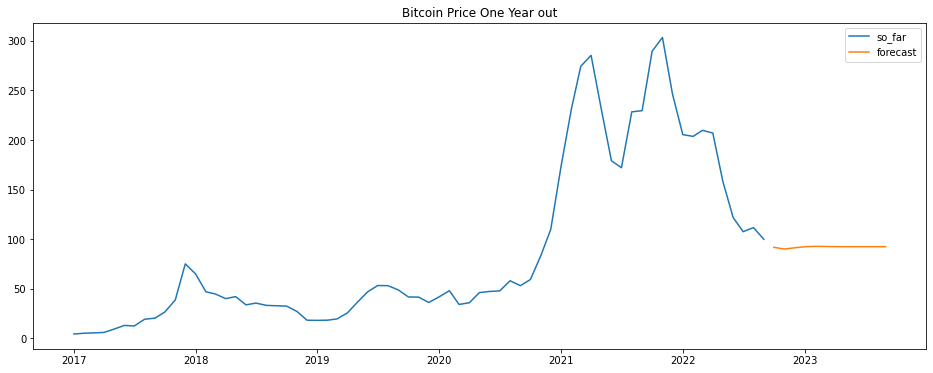
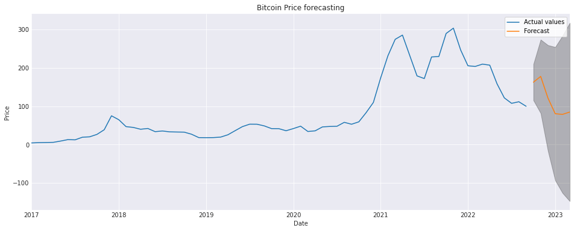
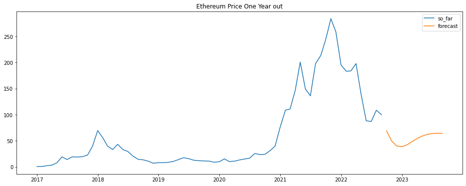
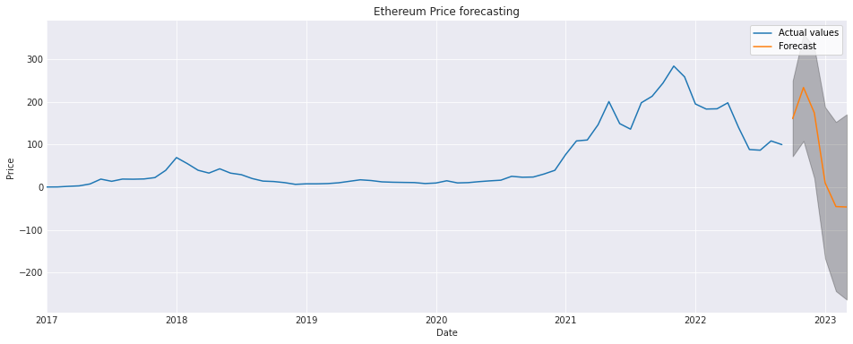
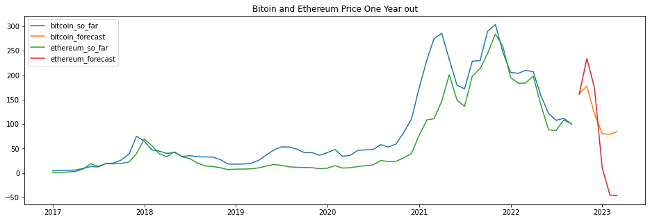

# Bitcoin and Ethereum Price Forecasting
Author: Volha Puzikava
***

## Disclaimer
The  described analyses fulfill educational purposes only. The hypothetical business case and the results of forecasting should not be considered as financial advice, and have not been approved by any professional or financial organization.
***

## Overview
Over the last decade, cryptocurrency has gone from overlooked asset to a wildly popular investment. Cryptocurrencies are a form of digital currency secured through cryptography and computer networks. Cryptocurrencies let us buy goods and services, use apps and games or trade them for profit. About 59.1 million Americans owned some form of cryptocurrency in 2021.

Of the more than 1,600 available cryptocurrencies on the market, both Bitcoin and Ethereum are in the top three. They usually move in tandem and are very similar to one another (not suprisingly, since the creator of ethereum learned from Bitcoin and produced more functionalities based on the concepts of Bitcoin). Bitcoin has the highest market cap among all the cryptocurrencies available right now. In a way, it’s the current world champion when it comes to cryptocurrencies. However, according to [Yahoo Finance](https://ca.finance.yahoo.com/news/why-ethereum-could-eventually-pass-200000116.html) Ethereum may overtake Bitcoin.

This project tends to forecast the price for both Bitcoin and Ethereum for the following 6 months in order to find out which of the two is worth investing into. 
***

## Business Problem
The Wall Street Company asked to analyze the prices of the top two cryptocurriences and predict their behaviour for the following 6 months in order to invest in the most promising one and lose as less money as possible. The main purpose of the analysis was to generate different time series models and reveal the most accurate forecast.
***

## Data Understanding
The data for the analysis was taken from [investing.com](https://www.investing.com/crypto/currencies) website. The dataframes contained Bitcoin and Ethereum daily historical data starting January 1, 2017. The information in the datasets included dates, high and low cryptocurrencies prices, the prices at which cryptocurrencies opened at those dates, volatility and the price percent change for those dates. The prices were analyzed up to August 31, 2022 and constituted 2,070 days of data.
***

## Data Preparation and Exploration
The data was uploaded and analyzed. It was found out that the dataframes were in reverse order (from August 31, 2022 to January 1, 2017). The format of the date columns were transformed, sorted in an ascending order and the date was  set as index. The type of the "Price" columns was changed from object to float. The dataframes were joined together for further analysis.

The resulted dataset was downsampled to monthly mean. As a result, the data with 69 rows was formed and used for further analysis. The data was visualized. The histograms and kde plots were created to check how the data was distributed.

From the performed visualizations, it was seen that the data was not normally distributed, but rather skewed. Also, Bitcoin and Ethereum prices belonged to different price ranges and didn't present an opportunity to analyze them one in term of the other.
***

## Data Modeling
Before building any time series models, the data of two cryptocurrencies had to be normalized to one scale. The goal was achieved by applying division and multiplication functions to the data.

### Bitcoin 
The time series was regrouped for yearly average values and compared to see if any changes took place over time. From the plots, it was seen that Bitcoin usually was at its peak once a year, however, in 2021 it reached its highest value twice.

Also, the boxplot showed that Bitcoin had some extreme values in 2017, 2018 and 2020. The other years could be considered smooth as no outliers were present.

Because chronological order matters in time series, the train-test split was performed by cutting off a portion of data at the end and reserving it as a test set. As a result, 80% of the data or 55 first rows were considered as a train set.

The data was ready for modelling. Different models were built and compared based on the Akaike's Information Criteria (AIC). AIC tested how well the models fit the data set without overfitting it. The AIC score rewarded models that achieved a high goodness-of-fit score and penalized them if they became overly complex. Better models had lower AIC. Also, p-values of weights and root mean square errors (RMSE) of train and test sets were analyzed. However, they were not of a big influence in decision making. The problem with RMSE was that with extending the lag length (including more lags as explanatory variables) a better value for RMSE was yielded. With AIC, on the contrary, the error increased when additional terms were included due to the adding penalty. Thus, lower AIC sometimes caused high RMSE, however, performed better outside the scope of the available data while forecasting. P-values were also not of a big concern. Some of them were a little higher than 0.05 and were retained in the models. The weights with much higher p-values were removed since they were not significant.

#### Baseline Model
Baseline model was built with the help of shift operator. The prediction for the next day was the original series shifted to the future.

The rolling standard deviation of the residuals as well as the residual variance were plotted. The graphs showed that the performance of the model varied at different points in time. It was due to the trends in the data. The series were made stationary by differencing the data. The stationarity of the data was then checked by the function that used rolling statistics and the Dickey-Fuller test.

The p-value associated with the Dickey-Fuller statistical test was equal to 0.039, which was less than 0.05, so we safely assumed that the differenced data was stationary.

#### Random Walk Model
Random Wlak Modle was generated and had the following parameters: AIC of 473.28 and RMSE of 18.84 for the train set.

Before plotting Autoregressive and Moving Average Models, autocorrelation and partial autocorrelation were plotted.

The Autoregressive Model was investigated first with lag length selected from the PACF. The shaded area of the graph represented the confidence interval. The correlation in the shaded area meant there was no statistically significant correlation between lags. From the graph it was clearly seen that within 1 lag the AR was significant. Which meant, we could use AR equal to 1. There was also a statistically significant 2nd term, so adding another AR was another posiibility.

Moving Average Model was predicted by using the ACF. The series showed positive significant correlation at lag 1, which suggested adding MA term equal to 1.

#### ARIMA Models
1st and 2nd order AR Models, 1st order MA Model as well as ARIMA(2, 1, 1) Model were generated. It was possible to reduce AIC by chance, adding p and q terms based on the ACF and PACF visualizations. However, the first step towards fitting an ARIMA model is to find the values of ARIMA(p,d,q) that produce the lowest AIC value. Selection of these parameters requires domain expertise and time. The small ranges of these parameters were generated and a "grid search" to iteratively explore different combinations of parameters was used. The output of the code suggested that ARIMA(2, 1, 0) or ar_2_bitcoin model yielded the lowest AIC value of 443.208. Those parameters considered to be optimal option out of all the models that were generated. The model was generated again before being tried on the test set.

#### ARIMA(2, 1, 0) Model
The generated model had AIC of 443.21 and was tried on the test set. The RMSE value constittuted 64.07 on the test set and predictions were made into the future. 

The predictions certainly left something to be desired. SARIMA (Seasonal Auto Regressive Integrated Moving Average) Model was generated to see if it could perform any better. Firstly, the optimal values that produced the lowest AIC value were found. The output of the code suggested that ARIMA(1, 1, 1) x (1, 1, 0, 12) yielded the lowest AIC value of 253.84. Those parameters considered to be optimal option out of all the models that were generated.

#### ARIMA(1, 1, 1) x (1, 1, 0, 12) Model
For the analyzed time series, weight of ar.S.L12 had a p-value much bigger than 0.05, and it was not reasonable to retain it in the model. The weight was removed and the model without it was generated.

#### ARIMA(1, 1, 1) x (0, 1, 0, 12) Model
Although AIC value increased to 349.75, it remained the lowest among the generated models. Also, the p-values of the present weights were below 0.05.

Model diagnostics were run to ensure that none of the assumptions made by the model have been violated. The purpose here was to ensure that residuals remained uncorrelated, normally distributed having zero mean. In the absence of those assumptions, it was not possible to move forward. 

Model diagnostics were not perfect, however, they suggested that the model residuals were near normally distributed. Thus, the KDE line followed pretty much close with the N(0,1) line. That was a good indication that the residuals were normally distributed. The qq-plot showed that the ordered distribution of residuals more or less followed the linear trend of the samples taken from a standard normal distribution with N(0, 1). Again, that was an indication that the residuals were normally distributed. The residuals over time didn't display any obvious seasonality and appeared to be white noise. That was confirmed by the autocorrelation plot, which showed that the time series residuals had low correlation with lagged versions of itself.

The model was tried on the test set. The RMSE value for the test set was 156.13.

It is common to have RMSE greater on the test set than on the training set. This normally happens because the training data are assessed on the same data that have been learnt before, while the test dataset may have unknown data that may give more errors or misclassification when doing prediction. The resulted RMSE value means that the model was able to forecast the average monthly Bitcoin prices in the test set within 156.1 of the real price. The monthly average Bitcoin prices ranged from around 4.5 to over 300 in the normalized data. 

Then, the predictions were made into the future.

### Ethereum
The time series was regrouped for yearly average values and compared to see if any changes took place over time. From the below plots, it was seen that Ethereum was at its peak once a year. In 2021 it reached its highest value.

Also, the boxplot showed that Ethereum did not have any outliers and could be considered to perform smoothly throughout the years.

The train-test split was performed by cutting off a portion of data at the end and reserving it as a test set. As a result, 80% of the data or 55 first rows were considered as a train set.

The data was ready for modelling. Different models were built and compared based on the Akaike's Information Criteria (AIC) in the same way as Bitcoin was analyzed. Better models with lower AIC were looked for.

#### Baseline Model
Baseline model was built with the help of shift operator. The prediction for the next day was the original series shifted to the future.

The rolling standard deviation of the residuals as well as the residual variance were plotted. The graphs showed that the performance of the model varied at different points in time. It was due to the trends in the data. The series were made stationary by subtracting the Exponentially Weighted Moving Average and differencing the data. The moving average is designed as such that older observations are given lower weights. The described method was chosen based on the following reasons: the method is widely used in finance, it smoothes the data, it is sensitive and follows data more closely without changing the values like log transformation does. The stationarity of the data was then checked by the function that used rolling statistics and the Dickey-Fuller test.

The p-value associated with the Dickey-Fuller statistical test was equal to 0.008, which was less than 0.05, so it was possible to assume that the differenced data was stationary.

#### Random Walk Model
Random Walk Model yielded AIC of 414.83 and RMSE of 10.96 for the train set.

Before plotting Autoregressive and Moving Average Models, autocorrelation and partial autocorrelation were plotted.

The Autoregressive Model was investigated first with lag length selected from the PACF. The shaded area of the graph represented the confidence interval. The correlation in the shaded area meant there was no statistically significant correlation between lags. From the graph it was clearly seen that within 2 lags the AR was significant. Which meant, we could use AR equal to 2. 

Moving Average Model was predicted by using the ACF. The series showed significant correlation at lag 2, which suggested adding MA term equal to 2.

#### ARIMA Models
2nd order AR and MA Models, as well as ARIMA(2, 1, 2) Model were generated. It was possible to reduce AIC by chance, adding p and q terms based on the ACF and PACF visualizations. The best values of ARIMA model were found by generating the small ranges of q and p parameters and using a "grid search" to iteratively explore different combinations of parameters. 

The output of the code suggested that ARIMA(2, 1, 3) yielded the lowest AIC value of 404.699. Those parameters considered to be optimal option out of all the models that were generated.

#### ARIMA(2, 1, 3) Model
The model was generated and tried on the test set. The model yielded RMSE of 159.72. The predictions were then made to the future.

The predictions certainly left something to be desired. Although lower AIC was achieved, most of the p-values got very high and were not significant. It was not reasonable to forecast using that model.

SARIMA (Seasonal Auto Regressive Integrated Moving Average) Model was generated to see if it could perform any better. Firstly, the optimal values that produced the lowest AIC value were found.

The output of the code suggested that ARIMA(0, 1, 0) x (0, 2, 0, 12) yielded the lowest AIC value of 261.417. Those parameters considered to be optimal option out of all the models that were generated.

#### ARIMA(0, 1, 0) x (0, 2, 0, 12) Model
It was reasonable to run model diagnostics to ensure that none of the assumptions made by the model have been violated. The diagnostics didn't come out perfect, however, the KDE line followed pretty much close with the N(0,1) line. The qq-plot showed that the ordered distribution of residuals more or less followed the red line. That was a strong indication that the residuals were nearly normally distributed. The residuals over time didn't display any obvious seasonality and appeared to be white noise. That was confirmed by the correlogram, which showed that the time series residuals had low correlation with lagged versions of itself.

The model was tried on the test set and yielded RMSE of 154.93. The model was able to forecast the average monthly Ethereum prices in the test set within 154.9 of the real prices.  The average monthly Ethereum prices range from around 0.5 to over 250 in the normalized data. Then, the predictions were made into the future.

***

### Model Evaluation
Thus, it was possible to conclude, that for Bitcoin the best forecasting model was sari_1_bitcoin with the following parameters: ARIMA(1, 1, 1) x (0, 1, 0, 12) with AIC of 349.75 and RMSE of 156.1. For Ethereum the best model was sari_ethereum: ARIMA(0, 1, 0) x (0, 2, 0, 12) with AIC of 261.42 and RMSE of 154.9.

The graph with the predicted and observed values for both Bitcoin and Ethereum from the chosen models was plotted. According to the graph, average monthly prices for Bitcoin will experience a small jump by the end of the year and then prices will start falling down. With Ethereum the situation will be similar, however, a big jump in monthly prices will be followed by a sudden big decline by the end of the year.

Although the predictions look similar, Bitcoin will experience mild changes while Ethereum will be subjected to cardinal adjustments in its behavior. As was mentioned in the beggining of the analysis, Bitcoin and Ethereum usually move in tandem, however, the resulted forecast shows some differences in the scope of predictions. The thing is that the correlation between bitcoin and ethereum for the last three months was only [0.61](https://www.macroaxis.com/invest/pair-correlation/BTC.CC/ETH.CC/Bitcoin-vs-Ethereum#:~:text=The%203%20months%20correlation%20between,assuming%20nothing%20else%20is%20changed), which is moderate correlation, meaning that as Bitcoin moves, either up or down, Ethereum will move in the same direction mostly of the times, but not all the time. Above all, Ethereum is an [independent asset and does not always accurately repeat the Bitcoin price movements](https://cointelegraph.com/news/truth-about-crypto-price-correlation-how-closely-does-eth-follow-btc).

Thus, judging by the resulted predicitons, it is possible to conclude, that Bitcoin is less risky one and among the two is worth investing into. However, as the forecast is made further out into the future, it becomes less confident in the values. In order to lose less money, it will be reasonable to invest in Bitcoin and sell the asset before its decline in the beginning-middle of October.

***

## Conclusions

Thus, based on the observations, sari_1_bitcoin and sari_ethereum are the best models for forecasting the average monthly prices for both cryptocurrencies for the following 6 months. Among the two, Bitcoin is worth investing into, since even with its ups and downs it will stay afloat according to the predictions. Ethereum will experience the same pattern in its evolution, however, the adjustments will be crucial.

Of coarse, the resulted models are not not perfect and more digging is necessary. Firstly, it is advisable to generate other time series models, such as Prophet. Secondly, since the latest data is more important in such types of forecasting, it would be reasonable to work with less data but shorter periods (like daily or weekly) due to the behavior of the cryptocurrencies. The main problem with the built above models was the historical development of the assets. Because both cryptocurrencies demonstrated high values starting 2021, the train sets of the models mostly contained the data with no clear ups and downs. It influenced the predictions and RMSE values, as the model had to deal with the uknown in the test sets. Thus, it would be more logical to work with the data starting 2020. Also, the ACI scores of the resulted models are not perfect and could be lessen with the further tuning. And least but not last, exogenous factors such as economic situation on the US market, political situation in the world, changes to the rules of cryptocurrencies protocols that include planned technical upgrades (forks), etc. were not taken into account. For now we can only conclude, that among the two, Bitcoin is less risky. However, it is strongly recommmended to do more thorough research and try other types of models.
***